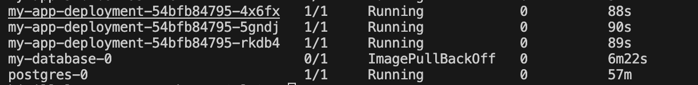

# Kubernetes деплоймент для моего приложения

Этот проект демонстрирует, как развернуть пример приложения и базу данных с использованием Kubernetes. Включает следующие компоненты:

1. **Deployment и Service для приложения**
2. **Настройка Ingress с Basic Auth**
3. **StatefulSet для базы данных с постоянным хранилищем**

## Требования

- Установленный [Minikube](https://minikube.sigs.k8s.io/docs/) на вашей локальной машине.
- Установленный [kubectl](https://kubernetes.io/docs/tasks/tools/install-kubectl/).
- Docker-образы для вашего приложения и базы данных (например, `my-app-image:latest` и `my-database-image:latest`).

## Инструкции по настройке

Следуйте этим шагам, чтобы настроить Kubernetes кластер и развернуть приложение.

### 1. Запуск Minikube
Убедитесь, что Minikube запущен:
```bash
minikube start


